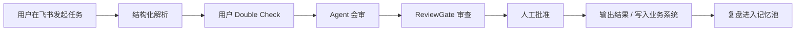

# AI 猎头作战系统

> 一个面向猎头团队的 AI 作战工作台：用飞书 War Room、多 Agent 会审、结构化任务确认、长期记忆和人工审批，把岗位校准、人才地图、候选人判断、触达草稿和复盘沉淀串成一条可控工作流。

AI 猎头作战系统不是“让一堆 Agent 自由聊天”的玩具，而是一个有统一事实源、有审查门、有记忆边界、有人工确认的招聘作战系统。它的目标很直接：让猎头少重复分析，少误判候选人，少把错误信息带进后续流程。

## 它解决什么问题

猎头工作里最费人的地方通常不是写一段话，而是这些反复发生的小混乱：

- 岗位需求每次都要重新解释一遍。
- 不同人对同一份简历的判断口径不一致。
- 人才地图、候选人证据、触达话术和复盘记录散在不同地方。
- AI 容易把历史记忆、当前事实和个人猜测混在一起。
- 外部触达、推荐结论、业务写入需要人把关，但系统常常缺少清晰审批流。

这个项目把这些环节拆成结构化流程：先确认任务，再让 Agent 按同一份事实工作，关键产物过 ReviewGate，真正有副作用的动作再交给人批准。

## 核心流程



## 核心能力

| 能力 | 作用 |
| --- | --- |
| 飞书 War Room | 用飞书群消息、交互卡片、按钮和 Bitable 同步承载日常任务、进度、确认和结果 |
| 结构化任务确认 | 把自然语言任务解析成固定字段，让用户确认后再进入正式流程 |
| 三省六部会审 | 在同一份 Canonical Context 下做角色化审查，减少 Agent 各说各话 |
| ArtifactStore | 全文产物集中存储，运行态只传摘要和引用，避免上下文膨胀 |
| PostgreSQL + pgvector 记忆 | 用向量检索注入少量相关记忆，不把全历史塞给模型 |
| ReviewGate | 对 JSON 字段、证据一致性、实用性、上下文预算和安全边界做质量门 |
| 人工审批 | 业务写入、外部触达、推荐结论和长期记忆 active 前都要人确认 |
| Docker Compose | 一条命令启动 API、worker 和 PostgreSQL/pgvector；HTTPS 入口由 `hiremate-caddy` 统一网关承载 |

## 你需要准备

先准备这些东西：

- 一台服务器或本机电脑。
- Docker Engine 和 Docker Compose v2。
- 一个域名，正式部署默认使用 `headhunt.zenithy.art`，A 记录解析到服务器公网 IP。
- 一个飞书开放平台应用和机器人。
- 一个飞书测试群和允许机器人工作的 chat。
- 一个 LLM / embedding API Key。

服务器上线先看 [服务器部署与使用手册](docs/manual/本地部署与使用手册.md)，里面包含 Deploy Key、DNS、Caddy、备份、回滚和冒烟步骤；服务器 Deploy Key 使用 `github.com-headhunt-agent` alias 和 `~/.ssh/id_ed25519_headhunt_agent`。不会配飞书的话，再看 [飞书接入操作手册](docs/manual/飞书接入操作手册.md)。

## 最快启动

### 1. 进入项目目录

```bash
cd /opt/apps/headhunt-agent
```

正式服务器路径固定为 `/opt/apps/headhunt-agent`。如果你是在 Windows 本机调试，就进入 `D:\apps\headhunt-agent`。

### 2. 生成环境变量文件

```bash
bash scripts/lietou-oneclick.sh
```

Windows 本机用：

```powershell
powershell -ExecutionPolicy Bypass -File scripts\lietou-oneclick.ps1
```

### 3. 打开 `.env` 填这些必填项

```env
DOMAIN=headhunt.zenithy.art
INTERNAL_ADMIN_API_KEY=<auto-generated>
POSTGRES_PASSWORD=<auto-generated>

FEISHU_APP_ID=
FEISHU_APP_SECRET=
FEISHU_VERIFICATION_TOKEN=
FEISHU_ENCRYPT_KEY=
FEISHU_DEFAULT_CHAT_ID=
FEISHU_BITABLE_APP_TOKEN=
FEISHU_BITABLE_REQUISITION_TABLE_ID=
FEISHU_BITABLE_CANDIDATE_TABLE_ID=
FEISHU_BITABLE_TALENT_MAP_TABLE_ID=
FEISHU_BITABLE_REPORT_TABLE_ID=

MODEL_SECRET_ENCRYPTION_KEY=<auto-generated>
MODEL_PROVIDER_ALLOWLIST=openai,deepseek
EMBEDDING_PROVIDER=openai
EMBEDDING_MODEL=text-embedding-3-small
EMBEDDING_API_KEY=
```

注意：

- `.env` 是你的私密配置，不能上传 GitHub。
- `.env.example` 是模板，可以上传。
- `<auto-generated>` 是文档占位，不要原样填进 `.env`；`bash scripts/lietou-oneclick.sh` 会自动替换 `POSTGRES_PASSWORD`、`INTERNAL_ADMIN_API_KEY` 和 `MODEL_SECRET_ENCRYPTION_KEY` 的本地占位值。
- `EMBEDDING_API_KEY` 可以先留空；只有需要服务器直接跑 OpenAI embedding fallback 时才填 OpenAI API Key。
- 不要把自动生成的密钥发到聊天或提交到 GitHub。
- 飞书多用户主路径不在 `.env` 里选择业务模型；用户通过飞书模型配置卡自己添加 OpenAI 或 DeepSeek API Key，服务端用 `MODEL_SECRET_ENCRYPTION_KEY` 加密保存。

### 4. 启动前自检

```bash
python3 -m app.runtime.local_doctor --strict
```

这一步不会输出密钥值；它会检查 `.env` 是否存在、关键变量是否仍是空值或 `change-this-*` 占位符、Docker 是否在 PATH 上，以及 `docker compose` 是否可用。

### 5. 启动服务

```bash
docker compose up -d --build
```

这条命令会启动：

- `api`：FastAPI 后端。
- `worker`：后台 outbox worker。
- `postgres`：PostgreSQL + pgvector。

统一网关模式下不会启动本项目自带 `lietou-caddy`。公网 HTTPS 入口在 `/opt/apps/hiremate` 的 `hiremate-caddy`，它会通过 `shared_gateway` 反代到 `lietou-api:8000`。

### 6. 查看服务状态

```bash
docker compose ps
docker compose logs -f api worker postgres
```

### 7. 检查 API 是否活着

```bash
curl https://<DOMAIN>/health
```

看到下面结果就说明基础 API 通了：

```json
{"status":"ok"}
```

再检查内部就绪状态：

```bash
curl -H "X-Internal-Admin-Key: <INTERNAL_ADMIN_API_KEY>" \
  https://<DOMAIN>/ready
```

如果你在本机测试，没有域名，可以先用：

```bash
curl http://127.0.0.1/health
```

正式服务器验收时使用：

```bash
curl https://headhunt.zenithy.art/health
curl -H "X-Internal-Admin-Key: <INTERNAL_ADMIN_API_KEY>" \
  https://headhunt.zenithy.art/ready
```

## 普通用户怎么用

目标使用方式是让用户只在飞书里操作，不需要懂 API。

常见输入长这样：

```text
@AI猎头机器人 新建岗位：北京 AI 产品经理，目标是岗位校准和人才地图
@AI猎头机器人 筛选候选人：候选人摘要... 目标岗位...
@AI猎头机器人 这个任务请走三省六部
```

一次完整任务大概是：

1. 用户在飞书群输入岗位或候选人任务。
2. 系统把任务拆成结构化字段。
3. 用户检查字段，选择 Approve、Edit 或 Reject。
4. Agent 按冻结后的任务字段工作。
5. ReviewGate 检查关键产物质量。
6. 需要写业务数据、发布报告或外部触达时，系统请求人工批准。
7. 用户拿到人才地图、候选人判断、触达草稿或复盘结果。

更完整的操作说明看：

- [飞书接入操作手册](docs/manual/飞书接入操作手册.md)
- [猎头日常使用手册](docs/manual/猎头日常使用手册.md)
- [数据准备与调用手册](docs/manual/数据准备与调用手册.md)

生产使用前，请按手册完成飞书、Bitable、数据库、LLM 和 HTTPS 回调联调。

## 常用命令

启动：

```bash
docker compose up -d --build
```

停止：

```bash
docker compose down
```

查看日志：

```bash
docker compose logs -f api worker postgres
```

运行测试：

```bash
.venv/bin/python -m pytest -q
```

运行 lint：

```bash
.venv/bin/python -m ruff check .
```

检查配置：

```bash
python3 -m app.runtime.local_doctor --strict
docker compose exec api lietou-config-check --strict
```

检查 PostgreSQL / pgvector：

```bash
docker compose exec api lietou-postgres-smoke
```

记忆 retention dry-run：

```bash
docker compose exec api lietou-memory-retention --dry-run
```

## 常见问题

### `docker: command not found`

你还没有安装 Docker。先安装 Docker Engine / Docker Desktop，再重新执行：

```bash
docker compose version
```

### `/ready` 返回 403

你没有带内部管理员 key。这样请求：

```bash
curl -H "X-Internal-Admin-Key: <INTERNAL_ADMIN_API_KEY>" \
  https://<DOMAIN>/ready
```

### Compose 提示 `set POSTGRES_PASSWORD`

你没有生成或保留自动数据库密码。先在项目根目录执行 `bash scripts/lietou-oneclick.sh`，再打开 `.env` 确认：

```env
POSTGRES_PASSWORD=<auto-generated>
```

### 飞书后台保存 endpoint 失败

先确认这些点：

- 正式域名是 `headhunt.zenithy.art`，DNS、`.env` 的 `DOMAIN` 和 Caddy 入口一致。
- 域名已经解析到服务器。
- Caddy 能正常申请 HTTPS。
- 飞书开放平台填的是 `https://<DOMAIN>/feishu/events` 和 `https://<DOMAIN>/feishu/card-actions`。
- `.env` 里的 `FEISHU_VERIFICATION_TOKEN` 和 `FEISHU_ENCRYPT_KEY` 填对了。
- 卡片交互使用新版 `card.action.trigger`，只配置到 `/feishu/card-actions`；不要再配置旧版消息卡片请求网址或 `card.action.trigger_v1`，否则可能重复回调或验签失败。

### 不知道该填什么数据

最小输入可以从这些开始：

- 岗位名、地点、职级、薪资范围。
- JD、must-have、nice-to-have。
- 候选人摘要、当前公司、职位、地点。
- 目标公司、排除公司、话术风格、交付格式。

## 上传到 GitHub

如果你是第一次把这个项目传到 GitHub，照着做：

### 1. 在 GitHub 网页创建空仓库

打开 GitHub，点击 `New repository`。

建议：

- Repository name：自己取，例如 `ai-headhunter-war-room`。
- Visibility：按需要选择 Public 或 Private。
- 不要勾选 `Add a README file`。
- 不要勾选 `.gitignore`。
- 不要添加 license。

创建后，GitHub 会给你一个仓库地址，例如：

```text
https://github.com/<your-name>/<repo-name>.git
```

### 2. 本地检查不要上传秘密文件

```bash
git status --short
```

确认不要出现这些文件：

```text
.env
.venv/
*.sqlite
*.db
.DS_Store
```

本项目已经在 `.gitignore` 里忽略这些文件。你只应该上传 `.env.example`，不要上传 `.env`。

### 3. 提交代码

```bash
git add .
git commit -m "Initial commit"
```

### 4. 连接 GitHub 仓库

把下面的地址换成你自己的 GitHub 仓库地址：

```bash
git remote add origin https://github.com/<your-name>/<repo-name>.git
```

### 5. 推送到 GitHub

```bash
git push -u origin main
```

如果提示你登录，按 GitHub 提示登录即可。

### 6. 上传后建议打开的 GitHub 功能

- Secret scanning。
- Push protection。
- Branch protection。
- Dependabot alerts。

这些功能可以降低 token、密码和高风险依赖被公开提交的概率。

## 项目文档

- [服务器部署与使用手册](docs/manual/本地部署与使用手册.md)
- [飞书接入操作手册](docs/manual/飞书接入操作手册.md)
- [故障排查手册](docs/manual/故障排查手册.md)
- [工程实施路线图](docs/engineering/00_实施总路线图.md)
- [完整 PRD](docs/prd/AI猎头作战系统_PRD_完整拼接版.md)

<details>
<summary>English Quick Start</summary>

# AI Headhunter War Room

AI Headhunter War Room is an AI-assisted recruiting operations system built around Feishu War Room, structured task confirmation, multi-agent review, PostgreSQL/pgvector memory, artifact storage, quality gates, and human approval.

## Quick Start

```bash
bash scripts/lietou-oneclick.sh
```

Edit `.env` and fill the Feishu/Bitable values. Local runtime secrets are generated by the command above:

```env
DOMAIN=headhunt.zenithy.art
INTERNAL_ADMIN_API_KEY=<auto-generated>
POSTGRES_PASSWORD=<auto-generated>
FEISHU_APP_ID=
FEISHU_APP_SECRET=
FEISHU_VERIFICATION_TOKEN=
FEISHU_ENCRYPT_KEY=
FEISHU_DEFAULT_CHAT_ID=
FEISHU_BITABLE_APP_TOKEN=
FEISHU_BITABLE_REQUISITION_TABLE_ID=
FEISHU_BITABLE_CANDIDATE_TABLE_ID=
FEISHU_BITABLE_TALENT_MAP_TABLE_ID=
FEISHU_BITABLE_REPORT_TABLE_ID=
MODEL_SECRET_ENCRYPTION_KEY=<auto-generated>
```

Run the preflight check:

```bash
python3 -m app.runtime.local_doctor --strict
```

Start the stack:

```bash
docker compose up -d --build
```

Check the API:

```bash
curl https://headhunt.zenithy.art/health
curl -H "X-Internal-Admin-Key: <INTERNAL_ADMIN_API_KEY>" https://headhunt.zenithy.art/ready
```

Do not commit `.env`. Commit `.env.example` only.

</details>
# headhunt-agent
