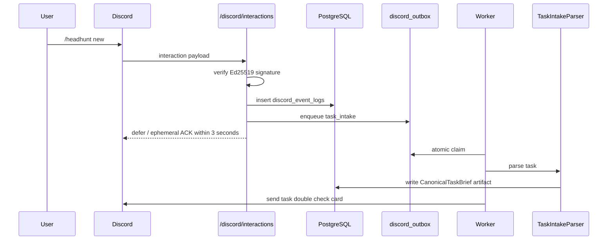

# Discord optional adapter 接入设计

## 状态

本文是 Discord optional adapter 的工程设计，不再作为第一版主入口或主验收路径。当前 `/discord/interactions` 已实现 Ed25519
signature 校验、PING/PONG 和 `/model add/list/use/test/revoke` BYOK 模型配置；
`/discord/commands/register` 和 `lietou-discord-register-commands` 已实现 slash command
注册能力；`/headhunt`、button、select menu、modal 审批、War Room thread/message、
DiscordGateway、discord_outbox 尚未完成真实端到端联调。后续如重新接入 Discord，必须复用 Feishu First 已确定的 CanonicalTaskBrief、ReviewGate、MemoryGateway、HumanApproval 和 Gateway 边界。

参考官方文档：
- [Receiving and Responding to Interactions](https://docs.discord.com/developers/interactions/receiving-and-responding)
- [Application Commands](https://docs.discord.com/developers/interactions/application-commands)
- [Message Components](https://docs.discord.com/developers/interactions/message-components)
- [Modal Submit Interaction](https://docs.discord.com/developers/interactions/message-components#text-inputs)
- [Gateway Intents](https://docs.discord.com/developers/events/gateway)

## 总原则

- `/discord/interactions` 是后续 optional adapter 入口，不是第一版用户入口。
- interaction HTTP 请求只做 signature 校验、allowlist、轻量命令处理、幂等、落库、outbox 和 ACK/defer；当前代码只实现 PING + `/model` BYOK。
- optional adapter 的完整 AI workflow 也必须在 ACK 后由 worker 异步执行。
- 用户必须 double check 结构化任务后才启动正式 graph。
- v1 使用 slash commands、buttons、select menus、modals，不依赖 `MESSAGE_CONTENT` privileged intent。
- Discord follow-up token 有时效限制；长期进度更新使用 bot token 发送或更新 message/thread。
- 任何业务副作用仍必须走 `interrupt()` 和 HumanApproval。

## 入口流程



## Signature 验证

`DiscordInteractionVerifier` 职责：

```text
读取 raw body，不先 JSON 解析。
读取 X-Signature-Ed25519。
读取 X-Signature-Timestamp。
用 DISCORD_PUBLIC_KEY 校验 timestamp + raw_body，并按 `DISCORD_SIGNATURE_MAX_AGE_SECONDS`
默认 300 秒拒绝过旧或未来偏移过大的 interaction，降低 replay 风险。后续 event log /
outbox 阶段再补 interaction_id/custom_id 级 durable replay 审计。
处理 PING 并返回 PONG。
校验 application_id、guild_id、channel_id allowlist。
```

签名失败必须返回 401/403，不写 outbox。数据库提交失败不得 ACK 成功。

## Slash Commands

v1 命令：

```text
/headhunt new
/headhunt candidate
/headhunt map
/headhunt status
```

命令输入尽量用结构化 option：

```text
role_title
company
location
seniority
jd_text
candidate_text
output_goal
council_mode_hint
attachment
```

用户明确在参数或文本中要求“三省六部”时，`user_forced_full_council=true`，强制 `full_council`。

## Task Double Check

`TaskIntakeParser` 输出：

```text
CanonicalTaskBrief
RequisitionBrief
ResumeProfile
CandidateEvidencePack
OutreachDraftInput
```

生成后发送任务确认卡：

```text
任务类型
用户目标
岗位摘要
候选人摘要
输出目标
缺失字段
风险等级
推荐 council_mode / mode_reason
系统假设
关键字段 field_source
关键字段 confidence
```

字段规则：
- 每个关键字段必须有 `field_source` 和 `confidence`。
- 无 source 的推断只能展示在 `assumptions`，不能进入 facts。
- 低置信字段必须展示给用户 double check。

用户动作：

```text
Approve：写 TaskDoubleCheckState approved，冻结 CanonicalTaskBrief version，并排队 graph_dispatch。
Edit：打开 modal，收集修改字段，生成新 version，重新解析，再次发送确认卡。
Reject：写 rejected，停止任务，可生成 UserCorrectionMemoryProposal。
```

custom_id 建议：

```text
task_check:approve:{task_id}
task_check:edit:{task_id}
task_check:reject:{task_id}
```

## 审批与 Resume

业务副作用前 graph 触发 `interrupt()` 并生成确认卡。

custom_id 建议：

```text
approval:approve:{thread_id}:{action_id}:{interrupt_id}:{idempotency_key}
approval:edit:{thread_id}:{action_id}:{interrupt_id}:{idempotency_key}
approval:reject:{thread_id}:{action_id}:{interrupt_id}:{idempotency_key}
```

流程：

```text
Discord button/modal -> /discord/interactions
-> signature 校验
-> idempotency_key 唯一约束
-> 写 HumanApproval
-> enqueue discord_outbox(kind='resume')
-> 3 秒内 ACK
-> worker 调用 Command(resume=HumanApproval)
-> 更新 War Room message/thread
```

`edit` 必须带 `edited_payload`；无编辑内容不得退化为 approve。

## War Room 消息

War Room 展示结构化过程，不展示原始 chain-of-thought。

每张卡片展示：

```text
thread_id
council_mode
mode_reason
节点 / Agent 名称
输入 artifact_refs
memory_refs 命中原因
sop_refs 命中原因
source_refs
ReviewGate 结果
token 估算
下一步动作
是否需要人工确认
```

展示模式：

```text
brief：结论、风险、追问。
standard：证据、工具、artifact 摘要、memory_refs、sop_refs。
debug：结构化 artifact 和工具日志，但不展示原始 prompt、隐私全文或 chain-of-thought。
```

默认 `standard`。

## Outbox 与幂等

`discord_outbox.kind`：

```text
task_intake
task_check
graph_dispatch
message_send
message_update
modal_open
resume
```

规则：

```text
ACK 前必须提交 discord_event_logs + discord_outbox。
worker 使用 FOR UPDATE SKIP LOCKED 或等价原子 claim。
interaction_id 唯一，idempotency_key 唯一。
重复 interaction 只 ACK，不重复启动 graph。
message send/update 失败进入 retry，超过次数进入 dead_letter。
```

## 权限和安装

需要的配置：

```env
DISCORD_PUBLIC_KEY=
DISCORD_BOT_TOKEN=
DISCORD_APPLICATION_ID=
DISCORD_ALLOWED_GUILD_IDS=
DISCORD_ALLOWED_CHANNEL_IDS=
DISCORD_INTERACTION_CALLBACK_PATH=/discord/interactions
DISCORD_COMMAND_REGISTER_GUILD_ID=
DISCORD_API_BASE_URL=https://discord.com/api/v10
DISCORD_SIGNATURE_MAX_AGE_SECONDS=300
```

管理员操作：

```text
创建 Discord Application。
创建 Bot 并保存 token。
复制 Public Key。
配置 Interactions Endpoint URL。
用 OAuth2 URL 邀请 Bot 到指定 guild。
注册 slash commands。
在系统中配置 guild/channel allowlist。
```

## 测试验收

```text
signature 校验单测。
PING/PONG 单测。
3 秒 ACK/defer 单测。
重复 interaction_id 不重复入队。
slash command -> task double check。
TaskIntakeParser 字段 source/confidence 单测。
无 source 推断只能进入 assumptions。
edit modal -> 新 version -> 重新解析 -> 再确认。
approve double check -> 冻结 CanonicalTaskBrief version -> graph_dispatch。
approval button/modal -> HumanApproval -> resume。
ContextPack 不含完整历史或完整 state。
真实 Discord 联调未执行前必须写“未验证”。
```
