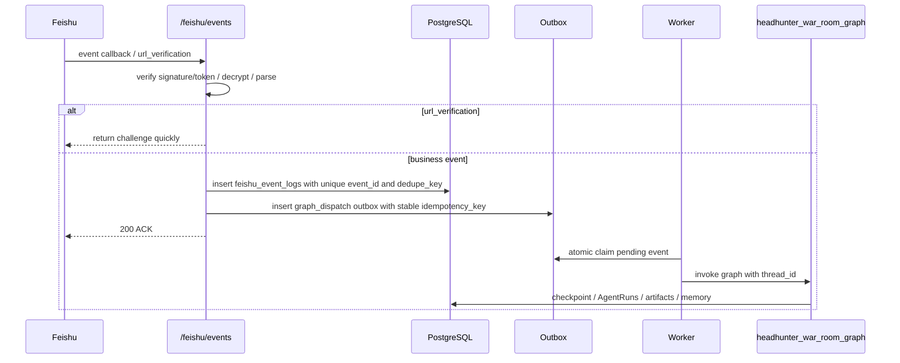
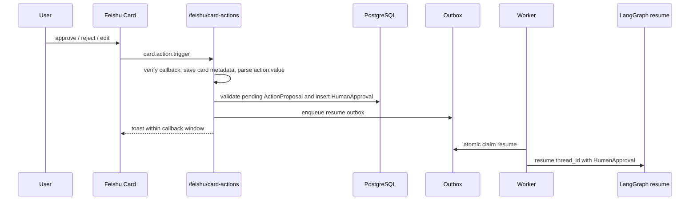
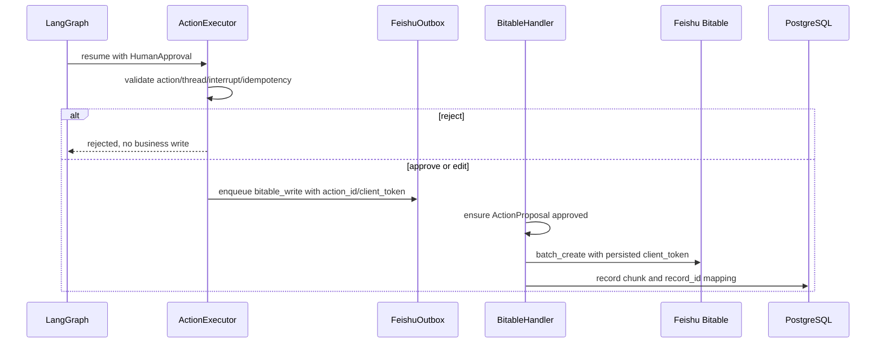

# 飞书接入设计

> 状态更新：本文件现在只描述 Feishu deferred adapter 和历史实现边界。第一版主工作台已经切换为 Discord First，飞书/Bitable 不再进入第一版主链路验收。新功能应优先写入 `docs/engineering/03_Discord接入设计.md`，除非用户明确要求实现飞书 adapter。

## 状态

本文基于现有 PRD 和飞书开放平台官方文档整理。当前已有飞书回调 verifier、
durable outbox、FeishuGateway、BitableGateway、Bitable chunk / record_id 映射、
LangGraph `interrupt()` / `Command(resume=...)` 本地测试路径、ActionProposal 校验和
审批后 Bitable outbox 排队，以及内部人工审批 API；真实飞书联调未执行。当前实现可作为后续 adapter 复用，但不能作为 Discord First 的默认入口。

参考官方文档：
- [将事件发送至开发者服务器](https://open.feishu.cn/document/event-subscription-guide/event-subscriptions/event-subscription-configure-/choose-a-subscription-mode/send-notifications-to-developers-server)
- [接收并处理回调](https://open.feishu.cn/document/event-subscription-guide/callback-subscription/receive-and-handle-callbacks?lang=zh-CN)
- [接收消息事件](https://open.feishu.cn/document/server-docs/im-v1/message/events/receive?lang=zh-CN)
- [卡片回传交互回调](https://open.feishu.cn/document/feishu-cards/card-callback-communication?lang=zh-CN)
- [处理卡片回调](https://open.feishu.cn/document/uAjLw4CM/ukzMukzMukzM/feishu-cards/handle-card-callbacks?lang=zh-CN)
- [多维表格新增多条记录](https://open.feishu.cn/document/server-docs/docs/bitable-v1/app-table-record/batch_create?lang=zh-CN)
- [多维表格概述](https://open.feishu.cn/document/server-docs/docs/bitable-v1/bitable-overview)

## Adapter 总原则

- 飞书回调层若启用，只负责快 ACK；完整 AI 工作流必须异步跑。
- ACK 前必须完成校验、幂等判定、原始 payload 保存、`FeishuEventLog` 写入和 outbox 写入。
- 任何重复事件、重复卡片点击、重复 resume 都通过数据库唯一约束和原子 claim 处理。
- 消息类事件不能只用 `event_id` 去重；必须用 `message_id` 形成稳定 `dedupe_key`，防止同一消息不同投递 ID 重复启动 graph。
- Bitable `batch_create` 必须传飞书官方 `client_token`，并把每个 chunk 的 token 持久化。
- Bitable chunk 成功后必须强校验 `records / record_ids / entity_refs` 对齐；同一
  `client_token` 遇到不同 `payload_hash` 或不同 `record_ids` 必须标记 conflict。
- 飞书 API 调用统一经过 `FeishuAuthProvider`、`FeishuGateway` 和 `FeishuBitableGateway`，不得绕过 `ChannelGateway` 污染 Discord First 主链路。
- `graph_dispatch` 只有在 runtime factory 注入真实 AgentHarness 后才放行；`resume`
  只有在 AgentHarness、ActionGate、ActionExecutor 同时装配后才放行。
- `/feishu/card-actions` 必须校验 `thread_id/action_id/interrupt_id/idempotency_key`
  匹配 pending `ActionProposal`，否则不得 enqueue resume。
- `bitable_write` outbox 执行前必须校验 `ActionProposal.status in ('approved','executed')`。
- War Room 卡片可以在任务授权后自动发送；业务写入、报告发布、飞书任务创建、外部触达和推荐结论必须人工确认。

## 事件订阅流程



### `/feishu/events` 处理步骤

1. 接收原始 body 和 headers，不要先反序列化后再验签。
2. 调用 `FeishuCallbackVerifier`：
   - 校验 `X-Lark-Request-Timestamp`、`X-Lark-Request-Nonce`、`X-Lark-Signature`。
   - 校验 timestamp freshness，拒绝过旧请求。
   - Encrypt Key 场景用 raw body 做签名校验，再解密。
   - 校验 Verification Token、app_id、tenant_key。
3. 如果是 URL 校验，目标 1 秒内返回 `challenge`。
4. 如果是业务事件，计算 `payload_hash`、`dedupe_key` 和 `idempotency_key`。
   - `im.message.receive_v1` 使用 `tenant_key:event_type:message_id` 作为稳定 `dedupe_key`。
   - 无 `message_id` 的事件使用 `tenant_key:event_type:event_id`。
5. 在同一事务中：
   - 写 `artifact_blobs` 或等价 payload store。
   - 插入 `feishu_event_logs(event_id, dedupe_key, idempotency_key)`。
   - 插入 `feishu_outbox(kind='graph_dispatch', idempotency_key=dedupe_key)`。
6. 如果 `event_id`、`dedupe_key` 或 outbox `idempotency_key` 已存在，返回成功 ACK，不重复入队。
7. PostgreSQL 事务提交成功后返回 200，body 使用最小成功响应。
8. 如果校验失败或 ACK 前数据库提交失败，不得返回成功 ACK，应返回错误让飞书重试或停止非法请求。

### 事件类型

第一版至少支持：

| 事件 / 回调 | 配置位置 | 用途 |
| --- | --- | --- |
| `im.message.receive_v1` | 事件订阅 | 用户在 War Room 或机器人会话发起任务；消息事件以 `message_id` 去重 |
| `im.chat.member.bot.added_v1` | 事件订阅 | 记录机器人可用范围 |
| 多维表格记录变更事件 | 事件订阅，可选 | 后续用于飞书表变更同步；第一版可先手动导入，具体事件名接入时以后台为准 |
| `card.action.trigger` | 回调配置，不放事件订阅列表 | approve / reject / edit 卡片回传；统一发送到 `/feishu/card-actions` |

不要同时配置新版和旧版卡片回传，避免双回调。第一版只订阅新版 `card.action.trigger`。

## 卡片回传流程



### action.value 必须包含

```json
{
  "thread_id": "uuid",
  "interrupt_id": "uuid",
  "action_id": "uuid",
  "idempotency_key": "stable-key",
  "decision": "approve | reject | edit",
  "payload_ref": "artifact://uuid/v1"
}
```

编辑型卡片还需要 `form_value` 映射到 `edited_payload_ref`，不能把大 payload 直接塞进卡片 value。

卡片回调还要保存或审计：
- `open_message_id`
- `open_chat_id`
- 操作人 `open_id`
- `event.token` 的安全引用。它是卡片更新 token，不是 Verification Token，不能混用。

### 卡片回传响应

卡片回调响应只做用户反馈，例如：

```json
{
  "toast": {
    "type": "info",
    "content": "已收到确认，系统正在继续处理"
  }
}
```

不得在卡片回调同步跑完整 graph、同步写大量业务数据或同步调用大量外部 API。

## 审批后副作用执行



## FeishuCallbackVerifier

所有 `/feishu/events` 和 `/feishu/card-actions` 请求都必须先经过 verifier。

职责：
- 读取 raw body、`X-Lark-Request-Timestamp`、`X-Lark-Request-Nonce`、`X-Lark-Signature`。
- 校验 timestamp freshness，防止重放。
- Encrypt Key 场景按飞书官方签名规则用 raw body 校验签名，再解密 payload。
- 无 Encrypt Key 或卡片旧式签名场景，按当前飞书后台配置和官方 SDK 进行 Verification Token / signature 校验。
- 解密后校验 body 中的 Verification Token、app_id、tenant_key。
- URL challenge 场景同样走 verifier，但必须目标 1 秒内完成响应。

实现时优先使用 `lark-oapi` 官方 SDK 的回调处理能力；如自实现，必须用官方文档中的签名算法和测试 payload 做契约测试。

## War Room 卡片类型

| 卡片 | 是否自动发送 | 触发 |
| --- | --- | --- |
| 任务授权卡 | 否，需用户明确授权 | 新任务识别后 |
| 进度卡 | 是 | 授权后的 graph 节点进度 |
| 追问卡 | 是 | 缺少必要信息 |
| 确认卡 | 是 | 需要人工批准副作用 |
| 结果卡 | 是 | 阶段结果或最终结果 |
| 错误卡 | 是 | 可恢复错误或需要人工处理 |

所有卡片都必须展示：
- `thread_id`
- 当前 `council_mode`
- `mode_reason`
- 关键 artifact refs
- 注入的 memory_refs 摘要和命中原因
- 是否需要人工确认

## FeishuAuthProvider

职责：
- tenant_access_token 获取和缓存。
- singleflight 防止并发重复刷新。
- token 过期前提前刷新。
- 401 或 token invalid 时强制刷新一次并重试。
- 所有 secret 从环境变量读取，不写入代码和日志。

环境变量：

```bash
FEISHU_APP_ID=
FEISHU_APP_SECRET=
FEISHU_VERIFICATION_TOKEN=
FEISHU_ENCRYPT_KEY=
FEISHU_BASE_URL=https://open.feishu.cn
```

## FeishuGateway

职责：
- 发送 War Room 消息卡片。
- 更新卡片。
- 校验机器人是否在目标 chat。
- 处理 429、Retry-After、5xx 重试。
- dead letter 记录到 outbox。
- 所有 API 响应检查 `code`，非 0 进入错误处理。

第一版需要封装：
- `send_card(chat_id, card, idempotency_key)`
- `update_card(open_message_id, card, idempotency_key)`
- `send_text(chat_id, text, idempotency_key)`

## FeishuBitableGateway

职责：
- Bitable 批量写入、更新、upsert。
- 单次批量上限按官方文档分片。
- 记录 `record_id` 映射。
- 每个写入 chunk 生成并持久化 `client_token = action_id/table_id/chunk_index/payload_hash`，调用 Bitable `batch_create` 时传入。
- 如果 OpenAPI 成功但网络超时，重试必须复用同一个 `client_token`。
- 如果遇到 `client_token` conflict，不得换 token 盲目重试，必须进入审计或人工处理分支。
- 部分失败时保留成功记录，失败记录进入 outbox 重试或 dead letter。
- 写入前检查人工确认结果。

环境变量：

```bash
FEISHU_BITABLE_APP_TOKEN=
FEISHU_BITABLE_REQUISITION_TABLE_ID=
FEISHU_BITABLE_CANDIDATE_TABLE_ID=
FEISHU_BITABLE_TALENT_MAP_TABLE_ID=
FEISHU_BITABLE_REPORT_TABLE_ID=
```

## 幂等策略

| 场景 | 幂等键 |
| --- | --- |
| 事件投递 | `event_id` |
| 消息触发任务 | `tenant_key:event_type:message_id` |
| 卡片点击 | `event_id` + `idempotency_key` |
| War Room 卡片发送 | `thread_id:card_type:step_id` |
| Bitable 写入 | 内部 `entity_type:entity_id:table_id` + 飞书官方 `client_token` |
| graph resume | `thread_id:interrupt_id:action_id:decision_hash` |

## 权限清单

第一版需要用户在飞书开发者后台按实际 API 开通最小权限。具体 scope 名称以飞书后台当前显示为准，实施时用 Chrome 插件或人工截图复核。

至少需要：
- 机器人发消息 / 以应用身份发送消息。
- 接收消息或机器人被 @ 的事件。
- 卡片回传交互。
- 多维表格读取、写入、编辑。
- 获取用户 open_id 或必要用户标识。

## 本地联调

1. 本地启动 FastAPI。
2. 使用 HTTPS 隧道暴露公网地址，例如 ngrok 或 Cloudflare Tunnel。
3. 飞书开发者后台配置：
   - 事件订阅：将事件发送到开发者服务器，URL 为 `https://your-domain/feishu/events`
   - 回调配置：卡片回传交互 `card.action.trigger`，URL 为 `https://your-domain/feishu/card-actions`
4. 先验证 challenge。
5. 再发送测试消息触发 outbox。
6. 最后测试确认卡 approve / reject / edit。

## 未验证事项

- 当前没有飞书应用配置，未验证真实权限、scope 名称、事件类型和 SDK 版本。
- 当前没有本地服务，未验证 callback URL、challenge、卡片回传和 Bitable 写入。
