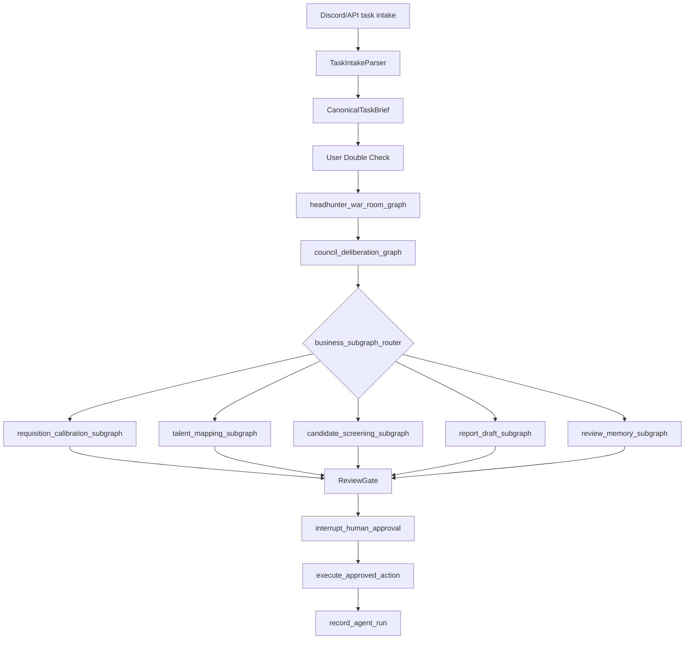

# Agent 与 ContextPack 设计

## 状态

本文是 Agent、Graph、ContextPack 和记忆注入的工程施工文档。当前已有 ContextPack
schema、ContextPackBuilder typed snapshot、ArtifactStore repository、MemoryGateway /
pgvector 检索、LangGraph 根图 / council 子图 / 业务子图、AgentHarness、OpenAI
Responses LLMGateway、OpenAI EmbeddingGateway、AgentRuns 写入、RunMemory 写入和
War Room 卡片 outbox、ActionGate、真实 LangGraph `interrupt()` / resume 和审批后
`bitable_write` outbox 排队。PRD 已切换为 Discord First；Discord interaction、
TaskIntakeParser double check、ReviewGate、AgentSOPRegistry 和 memory retention job 尚未实现。
真实 PostgreSQL 服务、真实 PostgreSQL checkpointer、真实 Discord 联调和真实飞书联调仍待验证。

## 运行图



根图负责：
- 接收已经 double check 并冻结 version 的 `CanonicalTaskBrief`。
- 跑 council 子图。
- 选择业务子图。
- 处理 ReviewGate、中断、恢复、进度卡和最终结果。

当前实现边界：
- 最小图可本地验证 `council_mode`、子图路由和 artifact ref 摘要策略。
- 子图通过 wrapper 只返回 delta，避免 LangGraph reducer 在父图重复追加 state。
- 飞书 outbox 的 `graph_dispatch` 只有在 runtime factory 注入真实 AgentHarness 后才
  放行；`resume` 只有在 AgentHarness、ActionGate、ActionExecutor 同时装配后才放行。
- 业务子图只产草稿 artifact；审批节点用 ActionGate 创建幂等 ActionProposal 和确认卡，
  然后触发 `interrupt()`。恢复后由 ActionExecutor 校验 HumanApproval，approve/edit
  只排队业务 outbox，reject 不写业务数据。
- `full_council` exact-count 测试要求六部 + `ChallengeReviewAgent` 共 7 条会审意见，
  `CouncilSynthesizerAgent` 只汇总，不作为部门意见重复写入。

council 子图负责：
- 基于 `CanonicalTaskBrief` 识别风险、必要信息和执行路径。
- 自动选择 `council_mode`。
- 决定 required / optional agents。
- 输出 `CouncilDecision`。

业务子图负责：
- 只做本业务域任务。
- 通过 ArtifactStore 交换结构化产物。
- 通过 ActionGateway 提出副作用。

正式 graph 之前：
- `TaskIntakeParser` 解析 Discord slash command、附件摘要、modal 字段或 API payload。
- 产出 `CanonicalTaskBrief / RequisitionBrief / ResumeProfile / CandidateEvidencePack`。
- Discord 发送任务确认卡，用户 approve/edit/reject。
- `TaskIntakeParser` 输出的每个关键字段都必须带 `field_source` 和 `confidence`；无 source 的推断只能进入 `assumptions`。
- approve 后冻结 `CanonicalTaskBrief.version`，edit 必须生成新 version 并再次确认。
- 未 approve 的任务不得进入 `headhunter_war_room_graph`。
- 下游 Agent 只能读取冻结版 `CanonicalTaskBrief`、ArtifactRef、MemoryRef、SOPRef 和 SourceRef。

## council_mode

| 模式 | 使用场景 | Agent 数量 | 说明 |
| --- | --- | --- | --- |
| `triage` | 信息不足、只需澄清或分流 | `IntentRouterAgent + ComplianceRiskAgent + CouncilSynthesizerAgent` | 低 token，快速判断 |
| `lite` | 简单任务、低风险、已有足够上下文 | `IntentRouterAgent + StrategyDraftAgent + ComplianceRiskAgent + CouncilSynthesizerAgent` | 默认优先省 token |
| `standard` | 正常猎头任务、需要策略和风险判断 | 按 task_type 选择 2-4 个必要部门 Agent，并保留 `ChallengeReviewAgent` | 第一版常规模式 |
| `full_council` | 用户要求“三省六部”、高风险、重要交付 | 六部并行 + `ChallengeReviewAgent + CouncilSynthesizerAgent` | 成本最高，但审查最充分 |

强制规则：
- 用户文本包含“三省六部”或明确要求完整会审，`user_forced_full_council=true`，必须使用 `full_council`。
- 响应、War Room 卡片、AgentRuns 都要记录 `council_mode` 和 `mode_reason`。

## Agent 列表

| Agent | 职责 | 默认模式 |
| --- | --- | --- |
| IntentRouterAgent | 判断用户是在发 JD、给案例数据、要 Mapping、筛候选人、写话术、做报告，还是问系统规划 | triage+ |
| StrategyDraftAgent | 把用户需求翻译成初版作战目标、执行路径和所需数据 | lite+ |
| ChallengeReviewAgent | 门下省，专门挑错：歧义、缺字段、合规风险、错误 Mapping 风险 | standard+ |
| ExecutionDispatchAgent | 尚书省，根据会审结论派发到具体 graph，并定义执行顺序 | standard+ |
| CandidateJudgementAgent | 吏部，从候选人画像、人岗匹配、证据链角度审查需求 | standard+ |
| MarketCompAgent | 户部，从薪资、市场、目标公司、人才供给角度审查需求 | standard+ |
| OutreachValueAgent | 礼部，从岗位卖点、触达、客户推荐表达角度审查需求 | standard+ |
| SourcingMappingAgent | 兵部，从人才地图、渠道、title 变体、搜索策略角度审查需求 | standard+ |
| ComplianceRiskAgent | 刑部，从隐私、敏感属性、证据不足、平台边界角度审查需求 | triage+ |
| DataAutomationAgent | 工部，从数据导入、飞书表、数据库、自动化可行性角度审查需求 | standard+ |
| CouncilSynthesizerAgent | 汇总各 Agent 结论，形成 CouncilDecision 或阶段结论 | lite+ |

`full_council` 的硬定义：必须运行六部并行，即 `CandidateJudgementAgent`、`MarketCompAgent`、`OutreachValueAgent`、`SourcingMappingAgent`、`ComplianceRiskAgent`、`DataAutomationAgent` 全部产出 `CouncilOpinion` artifact，然后 `ChallengeReviewAgent` 读取六部意见进行挑战，最后 `CouncilSynthesizerAgent` 汇总。六部并行节点只能写自己的 artifact，不能互相调用或覆盖共享 state。

三省六部不是自由 agent-to-agent 聊天。所有角色读取同一份已冻结 Canonical Context 的允许字段，不能各自重新理解原始任务或原始简历。

## ContextPack schema

ContextPack 是 Agent 唯一可见的上下文包。

必备字段：
- `context_pack_id`
- `thread_id`
- `agent_name`
- `node_goal`
- `task_brief`（冻结版 `CanonicalTaskBrief` 的允许字段）
- `council_mode`
- `mode_reason`
- `artifact_refs`
- `memory_refs`
- `source_refs`
- `sop_refs`
- `budget_remaining`
- `excluded_context_reason`

禁止字段：
- 完整聊天历史
- 完整 `RecruitmentState`
- 完整 `node_history`
- 全量 AgentRuns
- 全量 artifacts
- 完整 artifact 内容
- 全量长期记忆
- 未授权的 PII 明文
- 其他 Agent 的原始 ContextPack
- 上游 Agent 原始 prompt
- 未经 double check 的原始任务全文
- 未冻结的 `CanonicalTaskBrief` version

## Context Allowlist

| Agent | 可拿上下文 | 不可拿上下文 |
| --- | --- | --- |
| TaskIntakeParser | Discord slash command / modal 字段、附件摘要、入口来源 | 完整 Discord 历史消息、非任务 channel 内容 |
| IntentRouterAgent | CanonicalTaskBrief 摘要、入口来源、少量 ProjectMemory refs | 历史全量对话、候选人明文库 |
| StrategyDraftAgent | CanonicalTaskBrief、RequisitionBrief 摘要、必要 ProjectMemory / CaseMemory refs | 全量案例库、候选人联系方式 |
| ChallengeReviewAgent | 六部或必要 Agent 的输出摘要、风险 flags、缺字段列表 | 原始 ContextPack、原始 prompt、全量素材 |
| ExecutionDispatchAgent | CouncilDecision 摘要、已确认约束、可执行 action refs | 未确认业务写入 payload 全文 |
| SourcingMappingAgent | Strategy 摘要、技能/公司/title 相关 memory refs、目标行业 source refs | 完整 state、其他 Agent prompt |
| CandidateJudgementAgent | 脱敏候选人摘要、岗位摘要、证据 refs、允许的 CaseMemory refs | 联系方式明文记忆、未经授权简历全文 |
| MarketCompAgent | 岗位摘要、薪资/市场相关 source refs、可用 CaseMemory refs | 候选人隐私明文 |
| OutreachValueAgent | 岗位卖点摘要、已确认候选人亮点摘要、话术模板 memory refs | 未确认推荐结论、未授权 PII |
| ComplianceRiskAgent | 当前提案摘要、PII 等级、证据 refs、policy 摘要 | 业务无关的大量历史 |
| DataAutomationAgent | 数据导入摘要、Discord/数据库 schema 摘要、自动化约束 | Discord/飞书 secret、模型 key、候选人联系方式明文 |
| CouncilSynthesizerAgent | 各 Agent 输出摘要、风险摘要、分歧点和置信度 | 各 Agent 原始 ContextPack、原始 prompt、全量素材 |
| ReviewGate | 被审 artifact、schema、审查 SOP、证据 refs、必要 memory/source refs | 原始 chain-of-thought、全量历史 |

## MemoryGateway 检索流程

```mermaid
flowchart LR
    A["agent_name + task_brief"] --> B["Policy scope filter"]
    B --> S["tenant/guild/user/project/requisition/candidate scope filter"]
    S --> C["pgvector similarity recall"]
    C --> D["metadata / recency / source trust weighting"]
    D --> E["rerank"]
    E --> F["MMR dedupe"]
    F --> T["retention weighting / expiry filter"]
    T --> G["token budget compression"]
    G --> H["MemoryRef list"]
    H --> I["retrieval audit"]
```



接口：

```python
retrieve(
    agent_name: str,
    task_brief: str,
    memory_scopes: list[str],
    filters: dict,
    top_k: int,
    max_tokens: int,
    policy: AgentPolicy,
) -> list[MemoryRef]
```

scope filter 必填字段：

```text
tenant_id
guild_id
user_id
project_id
requisition_id
candidate_id
```

缺失字段处理：
- `tenant_id`、`guild_id`、`project_id` 缺失时不得检索跨租户/跨项目长期记忆。
- `candidate_id` 缺失时不得检索候选人级记忆。
- `requisition_id` 缺失时不得检索岗位级记忆。
- 调试接口也必须记录 filters 和 excluded_reason。

默认只返回 `MemoryRef`：
- `memory_id`
- `summary`
- `score`
- `scope`
- `source_run_id`
- `content_ref`
- `hit_reason`

全文读取必须二次授权：
- policy 允许 `can_read_memory_content=true`
- 审计记录读取原因
- PII 等级不超过 Agent 权限

## AgentPolicy

```json
{
  "agent_name": "CandidateJudgementAgent",
  "allowed_tools": ["LLMGateway", "ArtifactStore.read_summary", "MemoryGateway.retrieve"],
  "allowed_memory_scopes": ["RunMemory", "CaseMemory"],
  "allowed_sop_scopes": ["candidate-review", "schema-review"],
  "max_memory_items": 5,
  "max_context_tokens": 3500,
  "can_read_memory_content": false,
  "pii_access_level": "medium",
  "allowed_side_effects": ["audit_write", "run_memory_write"],
  "requires_interrupt_for": ["recommendation_commit", "business_write", "outreach_send"]
}
```

## AgentHarness

AgentHarness 是所有 Agent 执行入口。

职责：
1. 读取 AgentPolicy。
2. 根据节点目标构造 `task_brief`。
3. 选择必要 artifact refs。
4. 调用 MemoryGateway 检索少量 MemoryRef。
5. 调用 AgentSOPRegistry 检索必要 SOPRef。
6. 裁剪 source refs 和 optional sop_refs。
7. 生成 ContextPack。
8. 调用 LLMGateway。
9. 校验结构化输出。
10. 通过 ReviewGate 审查关键产物。
11. 写 AgentRuns、ArtifactStore、RunMemory 和检索审计。

硬限制：
- `ContextPackBuilder` 的输入只能是 typed selector 或 allowed snapshot，例如 `IntentSnapshot`、`RequisitionSnapshot`、`ArtifactRefList`、`MemoryQuerySpec`，不能传入 raw `RecruitmentState`、raw messages、raw `node_history` 或完整 AgentRuns。
- build_context_pack 不能接收完整 state 作为 prompt 输入，也不能把完整 state 作为内部临时对象再选择字段。
- 如果节点需要 state 中的字段，必须先由 graph adapter 依据 allowlist 提取成 typed snapshot，并记录 `excluded_context_reason`。
- LLMGateway 的调用参数只能包含 `ContextPack` 和 schema，不允许出现 raw state、messages、node_history 或其他 Agent 原始 ContextPack。
- 超出预算时先裁剪低相关 memory，再裁剪 optional source_refs，最后压缩 task_brief；不能硬塞全历史。
- 超出预算时还要裁剪 optional sop_refs；每个节点最多 1 个主 SOP + 2 个审查 SOP。

## Artifact 策略

- Agent 输出必须落 ArtifactStore。
- LangGraph state 只保存 artifact 摘要、kind、version、content_ref。
- 大报告、候选人全文、搜索结果列表、长证据链都放 `artifact_blobs` 或后续对象存储。
- CouncilSynthesizer 只能读取各 Agent 输出摘要；如需全文，必须走明确授权和审计。

## RunMemory 与长期记忆

| 记忆 | 写入 | 进入检索池 |
| --- | --- | --- |
| RunMemory | 自动写入和向量化 | 可用于后续任务，但只返回摘要/ref |
| ProjectMemory | 需审批，初始 `draft` 或 `pending_review` | `status=active` 后 |
| AgentMemory | 需审批，初始 `draft` 或 `pending_review` | `status=active` 后 |
| CaseMemory | 需审批，初始 `draft` 或 `pending_review` | `status=active` 后 |
| UserCorrectionMemory | 需审批，初始 `draft` 或 `pending_review` | `status=active` 后 |
| ProceduralMemory | 需审批或版本发布 | `status=active` 且未撤销 |

`pending_review`、撤销或过期记忆不得被检索为 active memory。

Retention policy：
- `RunMemory` 默认 30 天。
- `ProjectMemory`、`AgentMemory`、`CaseMemory`、`UserCorrectionMemory` 默认 90 天。
- 命中频繁、人工确认的重要记忆可续期或升级为 `permanent`。
- `ProceduralMemory` / SOP 默认 permanent，但必须版本化和可撤销。

## AgentSOPRegistry

SOP 是版本化 Markdown/JSON 文件，不是外部框架运行时依赖。

规划目录：

```text
docs/agent-sops/
├── registry.json
├── business/*.sop.md
├── reviewers/*.sop.md
├── workflows/*.workflow.md
├── checklists/*.checklist.md
└── templates/*.template.md
```

触发策略：
- `always`
- `auto_attached`
- `agent_requested`
- `manual`

触发优先级：

```text
always -> auto_attached -> agent_requested -> manual
```

执行约束：
- `AgentSOPRegistry.resolve(agent_name, operation, task_type, policy)` 只能返回 `SOPRef`。
- 每个节点最多 1 个主 SOP + 2 个审查 SOP。
- `manual` SOP 只能由用户、管理员或人工审批指定。
- `auto_attached` 必须由 task_type、artifact_type、agent_name 或 risk_level 命中。
- 每次 resolve 写 `SOPResolutionAudit`。
- ContextPack 只注入 `sop_refs`，War Room 只展示 SOP id、版本、命中原因和 token 估算。

## ReviewGate

ReviewGate 是 artifact-level quality gate，不是全局聊天式审查。每个关键产物后运行该 artifact 对应的 ReviewGate：

- `SchemaValidator`：字段、类型、枚举、必填项。
- `EvidenceConsistencyReviewer`：结论是否有 evidence_refs/source_refs 支撑。
- `PracticalityReviewer`：个性化、价值主张、行动请求清晰度、猎头语气、合规风险、简洁度。
- `ContextBudgetReviewer`：是否传入全历史、全 state、过量 memory。
- `SafetyReviewer`：隐私、外部触达、候选人推荐结论是否越过人工确认。

结果：
- `pass`：进入下一节点。
- `needs_fix`：只回该 artifact 对应的 `repair_node` 自动修一次。
- `needs_human`：interrupt 人工确认。
- 第二次仍 `needs_fix` 必须升级 `needs_human`。

LangGraph conditional edge：

```text
artifact_node -> review_gate_for_artifact
pass -> next_node
needs_fix -> repair_node_for_this_artifact
needs_human -> interrupt_human_approval
repair_node_for_this_artifact -> review_gate_for_artifact
第二次 needs_fix -> interrupt_human_approval
```

硬限制：
- `needs_fix` 不得重跑完整 graph。
- `needs_fix` 不得重跑无关上游节点。
- repair_node 只能读取原 artifact、ReviewResult、冻结 CanonicalTaskBrief、必要 refs 和审查 SOPRef。
- ReviewGate 不读取完整聊天历史、完整 state、其他 Agent 原始 ContextPack 或原始 prompt。

事实与记忆边界：
- 公司背调、当前在职状态、融资、新闻、裁员和组织变化等当前事实必须来自 `SearchGateway.source_refs`。
- 长期记忆不得替代实时搜索，只能提供历史经验、taxonomy、项目规则、用户修正和 SOP。
- 简历关键词抽取以当前简历/JD artifact 为主，长期记忆只能辅助标准化技能 taxonomy、title 变体和用户修正规则。

## Token 消耗控制

- 默认为 `lite` 或 `standard`，只有必要时进入 `full_council`。
- ContextPack 要记录估算 token。
- 每个 Agent 的 `max_context_tokens` 独立配置。
- Discord War Room 只展示 memory_refs / sop_refs 命中原因和 token 估算，不展示原始 prompt。
- 对同一 task_brief 和 policy 的 MemoryGateway 检索可以短期缓存，但 cache key 必须包含 policy version、agent_name、allowed scopes、PII 级别、memory index version 和 active memory watermark；记忆撤销、过期、审批状态变化或 policy 降权后必须失效。

## 未验证事项

- 第一版默认 LLM / embedding 已配置为 OpenAI Responses / OpenAI embeddings 接口；
  真实模型调用未验证，因为当前未提供真实 API Key。
- token 估算器、rerank 算法和 MMR 参数尚未实测。
- Agent allowlist 已有单测覆盖最小 ContextPack 注入；真实生产数据联调仍未验证。
